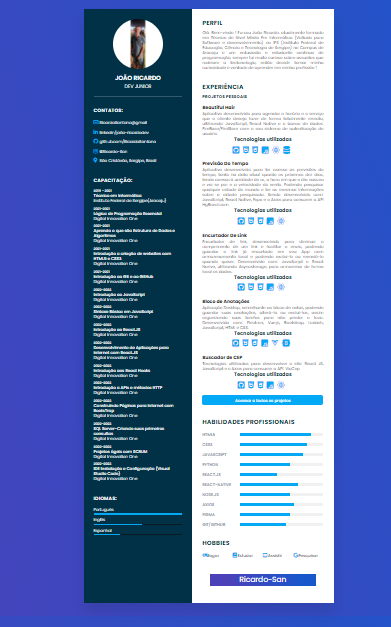

<h1  align="center">Portfólio</h1>

    Portfólio responsivo e em fase de aprimoramento, ainda não está finalizado, mas já está no ar hospedado no GitHub Pages

    
Tecnologias utilizadas: 
    

    <h2>Portfólio completo</h2>  
    

 

<h2 align="center">Click aqui para acessar o site hospedado no GitHub Pages: <a href="https://ricardosantanaevangelista.github.io/Portfolio/">Site</a></h2>
    

